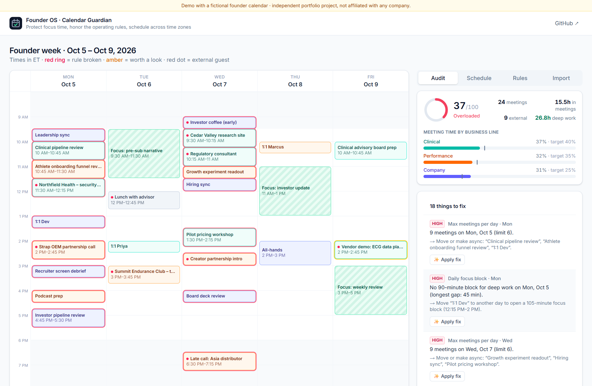
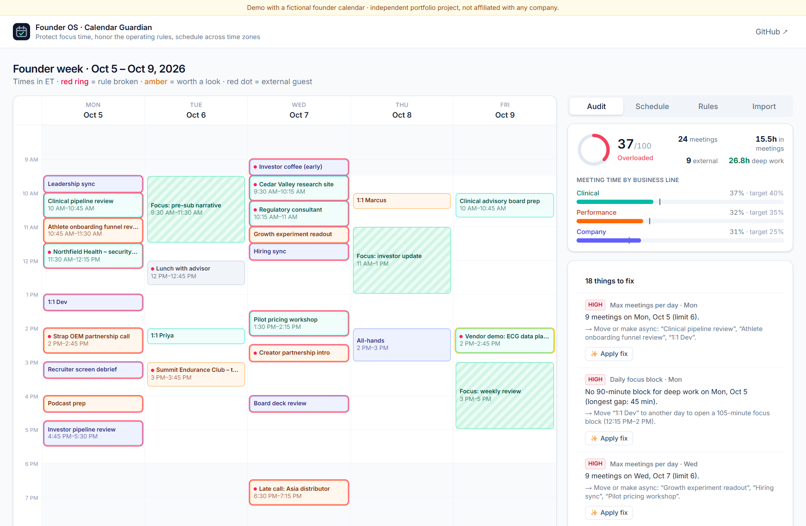
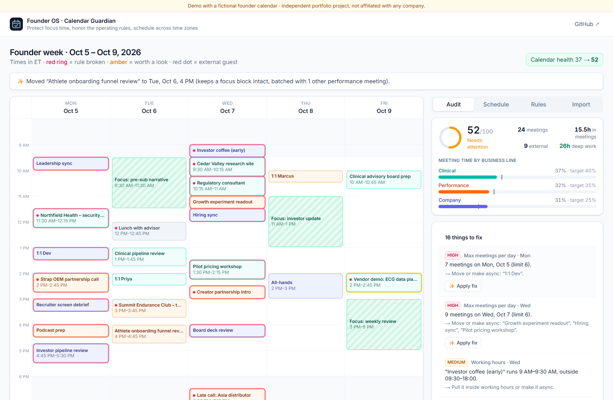
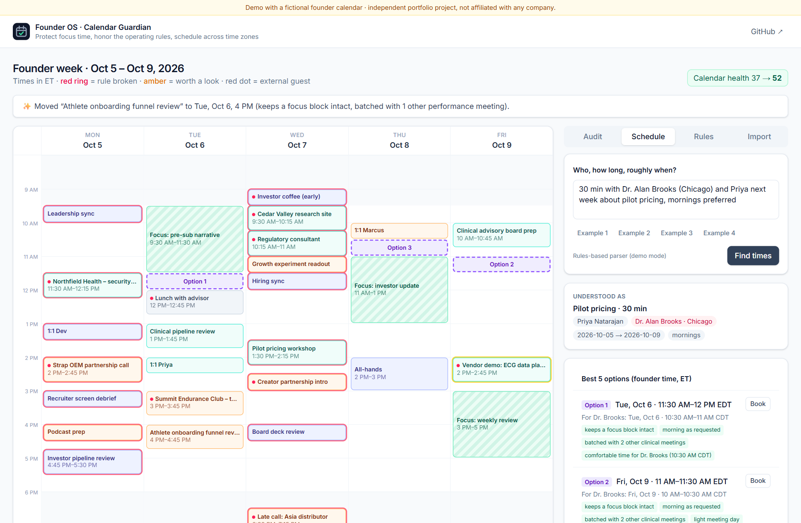
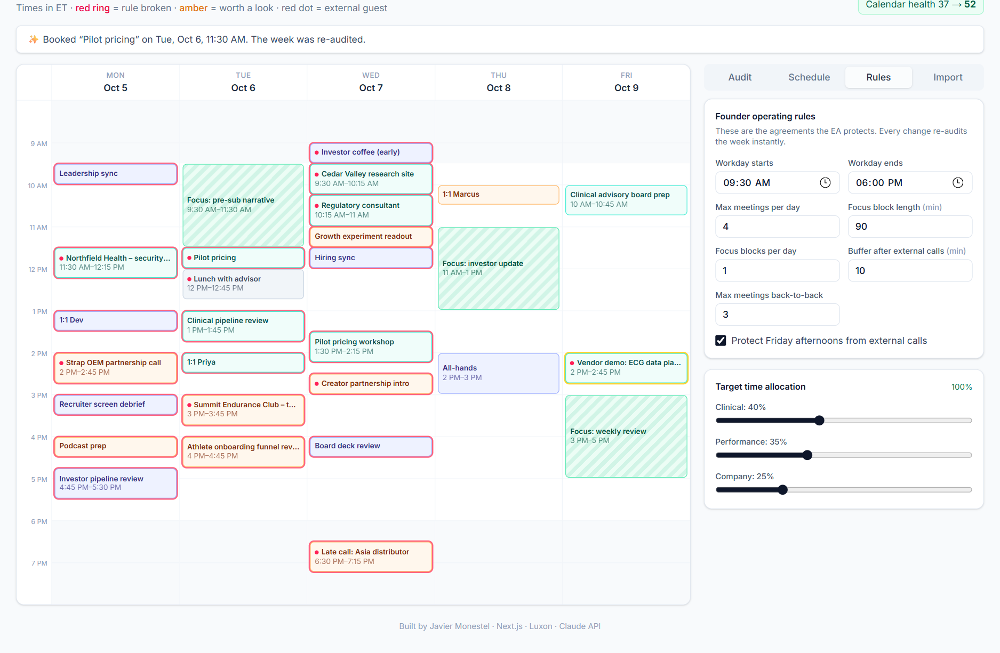

# Founder Calendar Guardian

**An executive assistant's calendar brain:** audit the founder's week against their operating rules, fix problems in one click, and find meeting times across time zones without breaking focus time.

[](https://founder-calendar-guardian.vercel.app)
[](https://github.com/JavierMonestel/founder-calendar-guardian/actions/workflows/ci.yml)




> **Try it:** [founder-calendar-guardian.vercel.app](https://founder-calendar-guardian.vercel.app). The fictional founder's week scores **37/100**. Click a problem to see it on the calendar, press **Apply fix** a few times and watch the score climb. Then open **Schedule** and ask for *"30 min with Dr. Alan Brooks (Chicago) and Priya next week about pilot pricing, mornings"*. You can also import your own `.ics` export; it is parsed in memory and never stored.

---

## Why

A founder running two business lines doesn't run out of tasks. They run out of **uninterrupted time**. The calendar is where that is won or lost, and protecting it is one of the most valuable things an executive assistant does:

- keep at least one deep-work block a day,
- stop the 9-meetings-in-a-row days,
- make sure time follows priorities (clinical vs. performance vs. company),
- and book external meetings at times that are good for *both* sides, in their time zones.

Calendar Guardian turns those agreements into explicit **operating rules**, checks every week against them, and explains each fix.

## Features

| | |
|---|---|
| **Week audit with a health score.** Eight rules: meetings per day, working hours, a daily focus block, back-to-back chains, buffers after external calls, protected Friday afternoons, agendas for external meetings, and time allocation per business line vs. target. Every finding comes with a concrete suggestion. |  |
| **One-click fixes.** "Move *1:1 Dev* to open a 105-minute focus block (12:15–2 PM)". **Apply fix** moves it to the best slot elsewhere in the week, chosen by the same scheduler that books new meetings, and the week is re-audited instantly. |  |
| **Scheduling across time zones.** Type the request the way you'd say it. It is parsed (Claude, or a rules parser in demo mode), then ranked slots are shown with the reasons for each, every guest's local time, an email draft in **their** time zone, and tentative holds as `.ics`. |  |
| **Editable rules.** Workday, focus length, meeting caps, buffers and allocation targets. Any change re-audits immediately. |  |

## How the scheduler decides

**Hard constraints** exclude a slot: an overlap with any event (focus blocks included), an internal attendee who is busy, no buffer after an external call (or before the next meeting, when booking an external one), Friday afternoon for external guests, and any guest outside 9:00–17:30 in **their** time zone.

**Soft preferences** rank what's left: morning or afternoon as requested, sooner rather than later, batching with same-line meetings, lighter days, no back-to-back, comfortable local times for guests, and a −40 penalty for eating the day's only focus block. Each adjustment becomes a visible reason ("keeps a focus block intact", "comfortable time for Dr. Brooks (10:30 AM CDT)"). Options on the same day are at least an hour apart, so they are real alternatives.

The **health score** starts at 100 and subtracts 10 / 5 / 2 per high / medium / low finding, counting each rule at most twice, so ten missing agendas can't sink a week on their own.

## API

The logic runs in the browser for instant feedback, and is also exposed for automations (for example a Sunday-evening n8n job that audits next week and posts the top three fixes to Slack):

| Endpoint | Body | Returns |
|---|---|---|
| `POST /api/audit` | `{ monday, events, rules }` | score, grade, violations with suggestions, totals |
| `POST /api/slots` | `{ request, events, rules }` | ranked slots with reasons + email draft |
| `POST /api/interpret` | `{ text }` | structured request (Claude with a Zod schema, or rules) |
| `POST /api/import` | multipart `.ics` + optional email | events for the busiest week in the file |

## Run it locally

```bash
git clone https://github.com/JavierMonestel/founder-calendar-guardian.git
cd founder-calendar-guardian
npm install
npm run dev          # optional: ANTHROPIC_API_KEY in .env.local for Claude parsing
npm test             # 16 Vitest tests: rules, scoring, fixes, time zones, parser, .ics
```

## Project structure

```
src/lib/
  audit.ts     the eight rules, focus-block detection, health score, fix suggestions
  slots.ts     slot search: hard constraints, soft scoring, reasons, option diversity
  fix.ts       one-click "move this meeting" using the scheduler
  request.ts   rules-based request parser (cities and zone abbreviations → IANA zones)
  ai.ts        Claude request interpretation with validation and fallback
  outputs.ts   email draft, tentative-hold .ics export, .ics import
  demo.ts      the fictional founder week (always "next week")
src/components WeekCalendar, AuditPanel, SchedulePanel, RulesPanel, ImportPanel
src/app/api/   audit · slots · interpret · import
```

---

**Built by [Javier Monestel](https://github.com/JavierMonestel)** as part of a portfolio on AI-native operations ([Command Center](https://github.com/JavierMonestel/founder-command-center) · [Meeting Action Router](https://github.com/JavierMonestel/meeting-action-router) · [OKR → Linear Planner](https://github.com/JavierMonestel/okr-to-linear) · [Automation Library](https://github.com/JavierMonestel/founder-os-automations)).
*Independent project. Not affiliated with, endorsed by, or built for any company. The calendar, people and organizations in the demo are fictional.*
